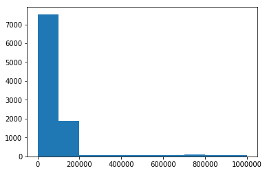
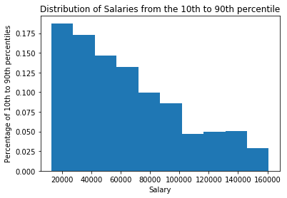

# Measures of Center
Below is a list of salaries. What would you consider a *normal* salary?


```python
#A pickle file is an easy way to store any object in python. Here we're loading in a list of salaries from file
#Read more about python pickling here: https://docs.python.org/3.6/library/pickle.html
import pickle
pkl_file = open('salaries.pkl', 'rb')
salaries = pickle.load(pkl_file)
```


```python
normal_salary = #Your code here
```

# Answers may vary but should generally be between 50K and 100K.
Notice that the mean and median are substantially different and that the distribution is highly skewed with a long tail. In general, using multiple measures of center and viewing the distribution as a whole provides a more representative picture of the dataset.


```python
import numpy as np
print('Median:', np.median(salaries))
print('Mean:', np.mean(salaries))
```

    Median: 56520.95346009167
    Mean: 93815.22131643743


```python
import matplotlib.pyplot as plt
%matplotlib inline
```


```python
plt.hist(salaries)
```


    (array([7540., 1890.,   71.,   78.,   71.,   69.,   57.,   86.,   72.,
              66.]),
     array([2.52752491e+01, 9.99905811e+04, 1.99955887e+05, 2.99921193e+05,
            3.99886499e+05, 4.99851805e+05, 5.99817111e+05, 6.99782417e+05,
            7.99747722e+05, 8.99713028e+05, 9.99678334e+05]),
     <a list of 10 Patch objects>)





```python
for i in range(10):
    i*=10
    print('{}th percentile is: {}'.format(i, np.percentile(salaries, i)))
```

    0th percentile is: 25.27524914258006
    10th percentile is: 12947.795044525215
    20th percentile is: 22773.888840195756
    30th percentile is: 32689.06595496359
    40th percentile is: 43906.99439419211
    50th percentile is: 56520.95346009167
    60th percentile is: 70561.43852939474
    70th percentile is: 88740.55739645724
    80th percentile is: 117736.01060494885
    90th percentile is: 160874.86301036485


```python
plt.hist?
```


```python
p10 = np.percentile(salaries, 10)
p90 = np.percentile(salaries, 90)
salaries_10_to_90 = [sal for sal in salaries if sal>=p10 and sal<=p90]
print(len(salaries_10_to_90))
plt.hist(salaries_10_to_90, weights=[1/len(salaries_10_to_90) for i in range(len(salaries_10_to_90))])
plt.title('Distribution of Salaries from the 10th to 90th percentile')
plt.xlabel('Salary')
plt.ylabel('Percentage of 10th to 90th percentiles')
```

    8000


    Text(0,0.5,'Percentage of 10th to 90th percentiles')




